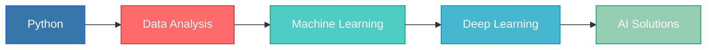

<div align="center">

# Hey, I'm Saleh

### Computer Science Student | Data Scientist in the Making


[](https://salehalomair.github.io/Portfolio/)
[](mailto:salehomair1424@gmail.com)

</div>

---


### 🎯 About Me

```python
class DataScientist:
    def __init__(self):
        self.name = "Saleh Alomair"
        self.role = "CS Student & Future Data Scientist"
        self.language_spoken = ["ar_SA", "en_US"]
        self.passions = ["Machine Learning", "AI Engineering", "Clean Code"]
        
    def current_focus(self):
        return ["Deep Learning", "Data Visualization", "Backend Systems"]
        
    def future_goals(self):
        return "Becoming a top-tier data scientist 📊🚀"
```

<br clear="right"/>

---

## 📊 GitHub Analytics

<div align="center">


</div>

<div align="center">

</div>

<details>
<summary>📈 <b>Detailed Analytics</b></summary>
<br>
<div align="center">

</div>
</details>

---

## 🛠️ Tech Arsenal

<div align="center">

### 💻 Programming Languages


### 🤖 Data Science & AI


### 🛠️ Tools & Environment


</div>

---

## 🎨 Creative Showcase

<div align="center">
  
</div>

<div align="center">
  
### 💡 Current Learning Path
  


</div>

---


<div align="center">

### 💭 Dev Quote of the Day


---


[](https://github.com/SalehAlomair)

**"Data is the new oil, and I'm here to refine it! "**

</div>
