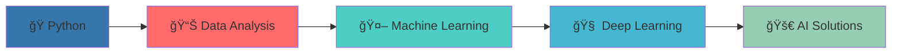

<div align="center">

# 👋 Hey, I'm Saleh

### 🚀 Computer Science Student | Data Scientist in the Making


[](https://salehalomair.github.io/MyWebsite/)
[](mailto:salehomair1424@gmail.com)

</div>

---


### 🎯 About Me

```python
class DataScientist:
    def __init__(self):
        self.name = "Saleh Alomair"
        self.role = "CS Student & Future Data Scientist"
        self.language_spoken = ["ar_SA", "en_US"]
        self.passions = ["Machine Learning", "Web Development", "Clean Code"]
        
    def current_focus(self):
        return ["Deep Learning", "Data Visualization", "Backend Systems"]
        
    def future_goals(self):
        return "Becoming a top-tier data scientist 📊🚀"
```

<br clear="right"/>

---

## 📊 GitHub Analytics

<div align="center">
  <picture>
    <source media="(prefers-color-scheme: dark)" srcset="https://github-readme-stats.vercel.app/api?username=SalehAlomair&show_icons=true&theme=tokyonight&bg_color=0D1117&border_color=21262D&icon_color=58A6FF&title_color=58A6FF&text_color=C9D1D9&include_all_commits=true&count_private=true&hide_border=true&border_radius=10">
    
  </picture>
  
  <picture>
    <source media="(prefers-color-scheme: dark)" srcset="https://github-readme-streak-stats.herokuapp.com/?user=SalehAlomair&theme=dark&background=0d1117&border=30363d&stroke=58a6ff&ring=58a6ff&fire=f85149&currStreakNum=ffffff&sideNums=ffffff&currStreakLabel=58a6ff&sideLabels=8b949e&dates=8b949e">
    
  </picture>
</div>

<div align="center">
  <picture>
    <source media="(prefers-color-scheme: dark)" srcset="https://github-readme-stats.vercel.app/api/top-langs/?username=SalehAlomair&layout=donut-vertical&theme=tokyonight&bg_color=0D1117&border_color=21262D&title_color=58A6FF&text_color=C9D1D9&langs_count=8&hide_border=true&border_radius=10">
    
  </picture>
</div>

<details>
<summary>📈 <b>Detailed Analytics</b></summary>
<br>
<div align="center">
  
</div>
</details>

---

## 🛠️ Tech Arsenal

<div align="center">

### 💻 Programming Languages


### 🤖 Data Science & AI


### 🛠️ Tools & Environment


</div>

---

## 🎨 Creative Showcase

<div align="center">
  
</div>

<div align="center">
  
### 💡 Current Learning Path
  


### 🏗️ Featured Projects
  
<div align="center">
  
  
</div>

<p align="center">
  <i>🚀 Replace with your own repositories once you create some awesome projects!</i>
</p>

</div>

---

<div align="center">

### 💭 Dev Quote of the Day


### 📈 Contribution Graph


---


[](https://github.com/SalehAlomair)

**"Data is the new oil, and I'm here to refine it! ⚡"**

</div>
